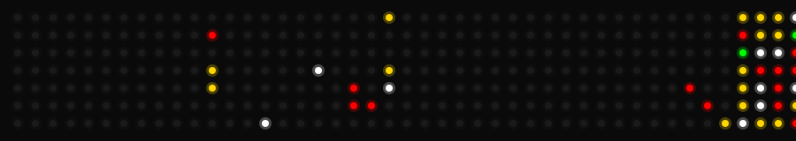

Olá me chamo Mariana Lima, sou estudante de Ciência da Computação, tenho 22 anos e estou em busca da primeira oportunidade profissional na área de TI.
Tenho interesse em desenvolvimento de software, programação e soluções inovadoras, e sou dedicada a aprender rapidamente e 
colaborar em projetos reais. Busco uma posição como estagiária ou desenvolvedora júnior, onde eu possa aplicar meus conhecimentos,
crescer profissionalmente e contribuir com a equipe.

[Portfólio](https://oliveirarl.github.io/OliveiraRL/#)

## 💻 Habilidades

## 🎄 Minhas contribuições em clima de Natal

